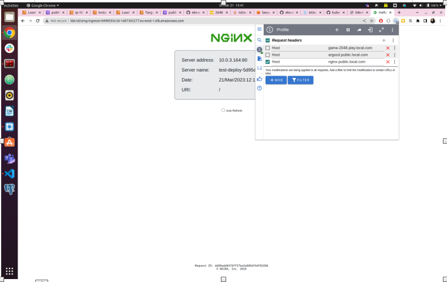
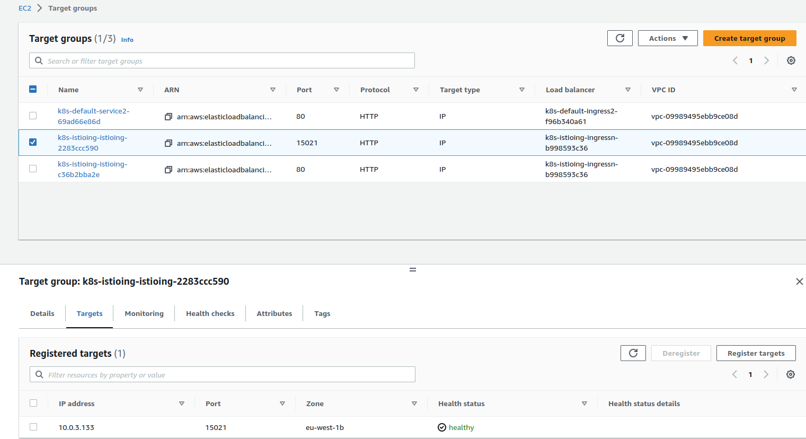

# **Secure end-to-end traffic on Amazon EKS using TLS certificate in ACM, ALB, and Istio**

**NOTE:** kubernetes service, deployment and ingress configuration is in `charts/nginx-demo/deployment.yaml`

### **gateway.yaml**
```shell

apiVersion: networking.istio.io/v1alpha3
kind: Gateway
metadata:
  name: alb-istio-gateway
  namespace: istio-ingress
spec:
  selector:
    app: istio-ingressgateway
    istio: ingressgateway
  servers:
    - hosts:
        - "*"
      port:
        name: https
        number: 443
        protocol: HTTPS
      tls:
        mode: SIMPLE
        credentialName: tls-secret
    - hosts:
        - "*"
      port:
        name: http
        number: 80
        protocol: HTTP
      tls:
        httpsRedirect: false
```

### **virtualservice.yaml**
```shell
apiVersion: networking.istio.io/v1alpha3
kind: VirtualService
metadata:
  name: test-virtualservice
  namespace: default
spec: 
  hosts:
  - "nginx.public.local.com"
  gateways:
  - istio-ingress/alb-istio-gateway
  http:
  - match: 
    - uri:   
        prefix: /
    route:
    - destination:
        host: test-svc
        port:
          number: 80

```

```shell
acharolia@ankitcharolia:~/review/aws-kube-services$ curl -I -H "HOST:nginx.public.local.com" k8s-istioing-ingressn-b998593c36-1687305277.eu-west-1.elb.amazonaws.com
HTTP/1.1 200 OK
Date: Tue, 21 Mar 2023 12:19:33 GMT
Content-Type: text/html
Connection: keep-alive
expires: Tue, 21 Mar 2023 12:19:32 GMT
cache-control: no-cache
```

### **Browser Access**



# **End to End Encrypted traffice using TLS Certificate between (ALB --SSL--> Istio Gateway ---> virtualservice ---> pod )**

### **Generate self-signed certificates. We will use a key/pair to encrypt traffic from ALB to Istio Gateway.**
```shell
openssl req -x509 -newkey rsa:4096 -sha256 -days 3650 -nodes \
  -keyout certs/key.pem -out certs/cert.pem -subj "/CN=public.local.com" \
  -addext "subjectAltName=DNS:public.local.com"
```

### **Generate Kubernetes secret containing key.pem and cert.pem. We will use it with Istio Gateway to implement traffic encryption.**
```shell
kubectl create -n istio-ingress secret generic tls-secret \
--from-file=key=certs/key.pem \
--from-file=cert=certs/cert.pem
```

```shell
acharolia@ankitcharolia:~$ kubectl get secrets -n istio-ingress 
NAME                       TYPE     DATA   AGE
istio-gateway-cert-hvxkj   Opaque   1      43h
tls-secret                 Opaque   2      2s
```

### **ALB Ingress**
```shell
apiVersion: networking.k8s.io/v1
kind: Ingress
metadata:
  namespace: istio-ingress
  name: ingress-nginx
  annotations:
    alb.ingress.kubernetes.io/scheme: internet-facing
    alb.ingress.kubernetes.io/target-type: ip
    # healthcheck-path: kubectl get po -n istio-ingress istio-ingressgateway-685fcc78c-8nz8f -o yaml
    alb.ingress.kubernetes.io/healthcheck-path: /healthz/ready
    # healthcheck-port: kubectl get svc -n istio-ingress istio-ingressgateway -o yaml
    alb.ingress.kubernetes.io/healthcheck-port: status-port
    alb.ingress.kubernetes.io/tags: Environment=stage,Team=devops
    alb.ingress.kubernetes.io/backend-protocol: HTTPS
    alb.ingress.kubernetes.io/listen-ports: '[{"HTTP": 80}, {"HTTPS":443}]'
    alb.ingress.kubernetes.io/actions.ssl-redirect: |
      {
        "Type": "redirect", 
        "RedirectConfig": { 
          "Protocol": "HTTPS", 
          "Port": "443", 
          "StatusCode": "HTTP_301"
        }
      }    
    alb.ingress.kubernetes.io/certificate-arn: |
      arn:aws:acm:xxxxxx:999999999999:certificate/xxxxxxxxx
spec:
  ingressClassName: alb
  rules:
    - http:
        paths:
        - path: /
          pathType: Prefix
          backend:
            service:
              name: istio-ingressgateway
              port:
                number: 443
        - path: /healthz/ready
          pathType: Prefix
          backend:
            service:
              name: istio-ingressgateway
              port:
                number: 15021
```

### **Istio Ingress Gateway**
```shell
apiVersion: networking.istio.io/v1alpha3
kind: Gateway
metadata:
  name: alb-istio-gateway
  namespace: istio-ingress
spec:
  selector:
    app: istio-ingressgateway
    istio: ingressgateway
  servers:
    - hosts:
        - "*"
      port:
        name: https
        number: 443
        protocol: HTTPS
      tls:
        mode: SIMPLE
        credentialName: tls-secret
    - hosts:
        - "*"
      port:
        name: http
        number: 80
        protocol: HTTP
      tls:
        httpsRedirect: true
```

### **verify routes and listeners using istioctl**
```shell
acharolia@ankitcharolia:~$ istioctl proxy-config routes -n istio-ingress  istio-ingressgateway-685fcc78c-8nz8f 
NAME                                                DOMAINS                     MATCH                  VIRTUAL SERVICE
https.443.https.gateway.istio-ingress               argocd.public.local.com     /*                     argocd-vsvc.argocd
https.443.https.alb-istio-gateway.istio-ingress     nginx.public.local.com      /*                     test-virtualservice.default
http.80                                             argocd.public.local.com     /*                     argocd-vsvc.argocd
http.80                                             nginx.public.local.com      /*                     test-virtualservice.default
                                                    *                           /healthz/ready*        
                                                    *                           /stats/prometheus*
```

```shell
acharolia@ankitcharolia:~$ istioctl proxy-config listeners -n istio-ingress  istio-ingressgateway-685fcc78c-8nz8f 
ADDRESS PORT  MATCH                                    DESTINATION
0.0.0.0 80    ALL                                      Route: http.80
0.0.0.0 443   SNI: *.public.local.com,public.local.com Route: https.443.https.gateway.istio-ingress
0.0.0.0 443   ALL                                      Route: https.443.https.alb-istio-gateway.istio-ingress
0.0.0.0 15021 ALL                                      Inline Route: /healthz/ready*
0.0.0.0 15090 ALL                                      Inline Route: /stats/prometheus*
```
### **ALB Istio Target Groups**


## **Useful Links**

* [Istio + ALB + EKS](https://aws.amazon.com/blogs/containers/secure-end-to-end-traffic-on-amazon-eks-using-tls-certificate-in-acm-alb-and-istio/)

* [Istio + ALB Using AWS Certificate Manager](https://rtfm.co.ua/en/istio-external-aws-application-loadbalancer-and-istio-ingress-gateway/)