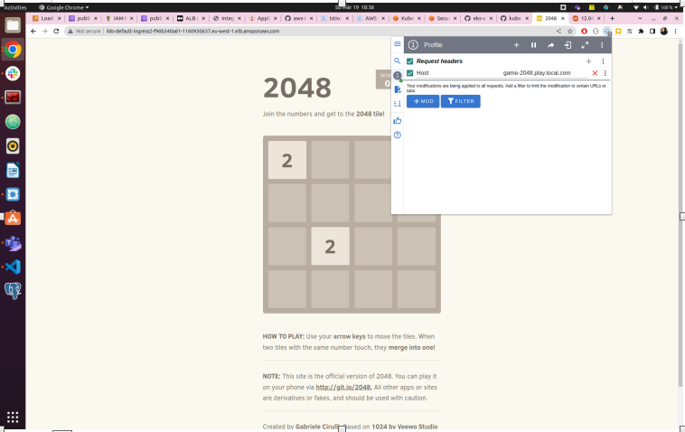

## **Deploy game-2048 with AWS LoadBalancer Controller**
```shell
kubectl apply -f charts/game-2048/full-deployment.yaml
```


```shell
acharolia@ankitcharolia:~/review/aws-kube-services$ kubectl get svc,ingress,po
NAME                   TYPE        CLUSTER-IP       EXTERNAL-IP   PORT(S)        AGE
service/kubernetes     ClusterIP   172.20.0.1       <none>        443/TCP        4d4h
service/service-2048   NodePort    172.20.124.194   <none>        80:32149/TCP   49m

NAME                                     CLASS   HOSTS                      ADDRESS                                                                  PORTS   AGE
ingress.networking.k8s.io/ingress-2048   alb     game-2048.play.local.com   k8s-default-ingress2-f96b340a61-1160930637.eu-west-1.elb.amazonaws.com   80      49m

NAME                                   READY   STATUS    RESTARTS   AGE
pod/deployment-2048-6bc9fd6bf5-gfr8g   1/1     Running   0          49m
pod/deployment-2048-6bc9fd6bf5-hhrkx   1/1     Running   0          49m
pod/deployment-2048-6bc9fd6bf5-j9fbp   1/1     Running   0          49m
pod/deployment-2048-6bc9fd6bf5-lts25   1/1     Running   0          49m
pod/deployment-2048-6bc9fd6bf5-tt2sn   1/1     Running   0          49m
```


```shell
acharolia@ankitcharolia:~/review/aws-kube-services$ curl  k8s-default-ingress2-f96b340a61-1160930637.eu-west-1.elb.amazonaws.com. -H "HOST:game-2048.play.local.com" -I

HTTP/1.1 200 OK
Date: Sun, 19 Mar 2023 16:30:10 GMT
Content-Type: text/html
Content-Length: 3988
Connection: keep-alive
Server: nginx
Last-Modified: Wed, 06 Oct 2021 17:35:37 GMT
ETag: "615dde69-f94"
Accept-Ranges: bytes

```

## **from browser**



**NOTE:** kubernetes service, deployment and ingress configuration is in `charts/aws-loadbalancer-controller/full-deployment.yaml`

## **Configure ALB Ingress to enable SSL certificate**
```shell
apiVersion: networking.k8s.io/v1
kind: Ingress
metadata:
  annotations:
    kubernetes.io/ingress.class: alb
    alb.ingress.kubernetes.io/scheme: internet-facing
    ...
    ...
    alb.ingress.kubernetes.io/listen-ports: '[{"HTTP": 80}, {"HTTPS":443}]'
    alb.ingress.kubernetes.io/actions.ssl-redirect: |
      {
        "Type": "redirect", 
        "RedirectConfig": { 
          "Protocol": "HTTPS", 
          "Port": "443", 
          "StatusCode": "HTTP_301"
        }
      }    
    alb.ingress.kubernetes.io/certificate-arn: |
      arn:aws:acm:xxxxxx:999999999999:certificate/xxxxxxxxx

```

## Useful Links:

* [Official AWS Loadbalancer Controller](https://kubernetes-sigs.github.io/aws-load-balancer-controller/v2.2/guide/ingress/annotations/)

