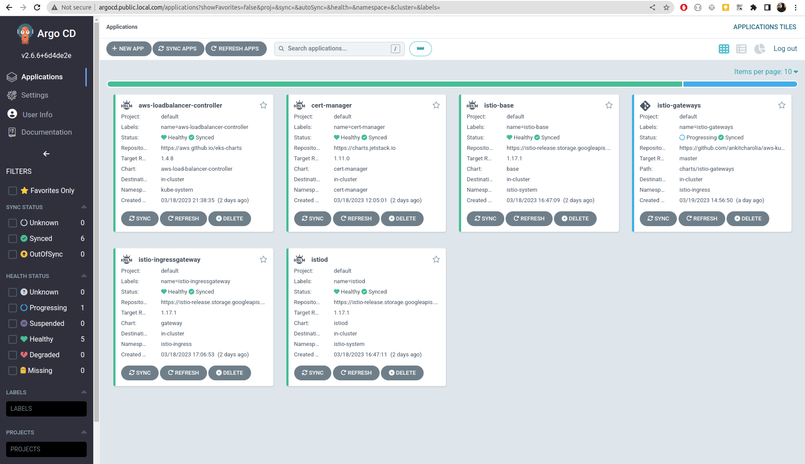

# **Secure end-to-end traffic on Amazon EKS using TLS certificate in EKS and Istio**

**NOTE:** This example is using ESK with Istio Ingress Gateway (Without AWS LoadBalancer Controller)
```shell
acharolia@ankitcharolia:~$ kubectl get po -n argocd
NAME                                                        READY   STATUS    RESTARTS   AGE
argo-cd-argocd-application-controller-0                     2/2     Running   0          23m
argo-cd-argocd-applicationset-controller-545ccfc6b5-dbdlc   2/2     Running   0          23m
argo-cd-argocd-dex-server-dfbd8f974-hvpb5                   2/2     Running   0          23m
argo-cd-argocd-notifications-controller-6958fd7b5f-svfl5    2/2     Running   0          23m
argo-cd-argocd-repo-server-69c9ddbf6c-rkf9q                 2/2     Running   0          23m
argo-cd-argocd-server-7576879bd8-xtlbq                      2/2     Running   0          23m
argo-cd-redis-ha-haproxy-776d4dc75f-6zxrn                   2/2     Running   0          23m
argo-cd-redis-ha-haproxy-776d4dc75f-jz4bm                   2/2     Running   0          23m
argo-cd-redis-ha-haproxy-776d4dc75f-qqgh4                   2/2     Running   0          23m
argo-cd-redis-ha-server-0                                   4/4     Running   0          23m
argo-cd-redis-ha-server-1                                   4/4     Running   0          22m
argo-cd-redis-ha-server-2                                   4/4     Running   0          21m
```

```shell
acharolia@ankitcharolia:~$ kubectl get virtualservices.networking.istio.io -n argocd
NAME          GATEWAYS                    HOSTS                         AGE
argocd-vsvc   ["istio-ingress/gateway"]   ["argocd.public.local.com"]   18m
```

```shell
acharolia@ankitcharolia:~$ curl -I -H "HOST:argocd.public.local.com" ace6578e04fdc4ddeae32e6cc949af93-933259602.eu-west-1.elb.amazonaws.com
HTTP/1.1 200 OK
accept-ranges: bytes
content-length: 788
content-security-policy: frame-ancestors 'self';
content-type: text/html; charset=utf-8
x-frame-options: sameorigin
x-xss-protection: 1
date: Mon, 20 Mar 2023 13:00:16 GMT
```

## **Browser Access**

